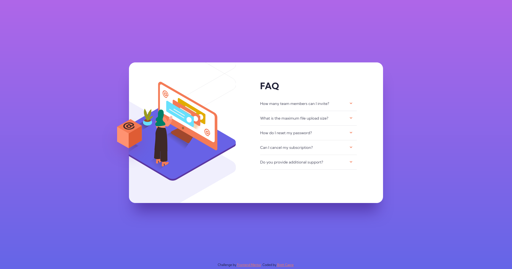

# Frontend Mentor - FAQ accordion card solution

This is a solution to the [FAQ accordion challenge on Frontend Mentor](https://www.frontendmentor.io/challenges/faq-accordion-card-XlyjD0Oam). 

## Overview

### The Challenge

Users should be able to:

- View the optimal layout for the component depending on their device's screen size
- See hover states for all interactive elements on the page
- Hide/Show the answer to a question when the question is clicked

### Screenshots

### Links

- Solution: 
- Live Site: [bcapra.com](https://www.bcapra.com/faq-accordion/)

## Author

- Website - [Brett Capra](https://www.bcapra.com)
- Frontend Mentor - [@b-capra](https://www.frontendmentor.io/profile/b-capra)